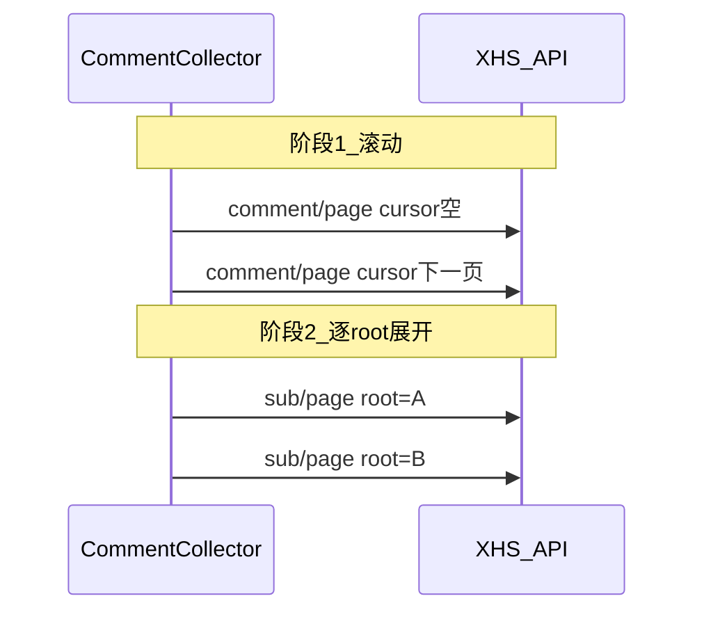

### **Q: 如何解决小红书批量评论采集中途失败、只采到少量评论或触发 300017 / 限流？**

**A:**
批量评论采集（侧边栏「批量采集评论」、`collectBy: "links"`）依赖 `GET comment/page` 翻一级评论，开启子评论后还需 `GET comment/sub/page` 按 root 展开。若笔记显示 94 条评论却只导出 10 条、或采到 30+ 条后停止并出现 `300017` / 空响应，多半是 **请求节奏不像真人**（一级页内突发多条 sub）、**xsec_token 用错**、或 **限流后仍重试**。当前实现采用 **两阶段采集 + 笔记级熔断**，按下面症状对照排查。

**问题症状：**

- 笔记页显示 94 条评论，导出 CSV 只有约 10 条（首屏 `comment/page` 后未继续翻页或中途熔断）
- 采到 30+ 条后停止，控制台 / 响应含 `300017`、`访问链接异常`、空响应或限流提示
- 开启「采集子评论」时 Network 出现 **1 次 `comment/page` 后立即 burst 多条 `sub/page`**（同页 10 条一级各打一条 sub 链）
- 侧边栏黄色提示：`已采集 N 条，未达目标数量：…`（`partialStopReason`）；已采数据仍可导出 CSV
- 修复风控后采集过慢（曾出现翻页前后双等待叠加，约 5~6 分钟）
- 开启「采集子评论」、表格「子评论数」显示 14 但只采到 1 条，Network 无 `comment/sub/page`（阶段 2 被 limit 阻断）

**根本原因：**

1. **请求模式不像真人（主因）**  
   旧逻辑在每页一级评论的 `for` 循环内同步调用 `collectSubComments` → 1 次 page + 最多 10 次 sub 链，密度远超浏览器「先滚动列表、再点开单条回复」。

2. **`xsec_token` 被响应覆盖**  
   浏览器抓包显示翻页全程使用 **笔记 URL 里的 token**，仅 `cursor` / `root_comment_id` 变化；若用响应里的 `xsec_token` 覆盖，易异常。

3. **限流/空页后仍重试**  
   同一 cursor 连打会放大风控；`300017`、空响应、安全限制类错误 **不可重试**。

4. **无效页未统一熔断**  
   `comments` 非数组、或 `comments: []` 且 `has_more: true` 时应停止翻页并保留已采数据，否则会继续无效请求。

5. **间隔叠加（次要，已调优）**  
   翻页后再叠一层 `waitInterval` 会导致过慢；子评论模式基础间隔现为 1~2s，root 间额外 0~1s。

6. **`limitPerId` 与两阶段计数冲突（已修复）**  
   开启子评论时，若 embedded 子评论与一级评论共用总数上限，阶段 1 结束即 `10/10`，阶段 2 入口因 `getCurrCompleted >= limit` 跳过全部 `sub/page`。修复后：**includeSub 时 limit 仅约束一级评论数**，子评论全量展开且不计入 limit；阶段 2 不再因 limit 满而跳过。

**解决方案：**

改动 `comment` 采集相关代码后，在 `chrome://extensions` **重新加载**扩展，并**刷新**小红书笔记页。

### 两阶段采集（对齐浏览器）



1. **阶段 1 — 滚动式一级**  
   仅循环 `comment/page`；每条一级 `addRecord` + 写入响应内 embedded `sub_comments`（零额外请求）；需深度子评论的一级入队 `pendingSubRoots`（`sub_comment_has_more` 或 `sub_comment_count > embedded.length`）。

2. **阶段 2 — 按需子评论**（`includeSub === true` 且未熔断）  
   按队列逐 root 调用 `sub/page`；每个 root 开始前额外等待；root 内翻页间隔由 `requestWithRetry` 统一控制。

3. **固定 xsec_token**  
   全程使用 `parseNoteUrl(pageUrl).token`，**不要**用 `parseCommentList` 返回的 `xsecToken` 覆盖。

4. **笔记级熔断 `degradedNotes`**  
   任一 comment/sub 请求失败或 `shouldDegradeCommentPage` 命中 → 该笔记不再发新请求；`partialStopReason` 提示用户，已采数据保留。

5. **评论 API `maxRetries = 0`**  
   限流/空响应不重试；仅网络超时类错误可重试（`isRetryableCommentError`）。

**错误模式示例：**

```typescript
// ❌ 一级页循环内同步打 sub（1 page + 10 sub burst）
for (const comment of parsed.comments) {
  await addRecord(comment)
  await collectSubComments(comment)  // 阶段1内不应调用
}

// ❌ 翻页时用响应 token 覆盖
xsecToken = parsed.xsecToken ?? xsecToken

// ❌ 空页 has_more 仍继续翻页
if (parsed.comments.length === 0) {
  cursor = parsed.cursor
  continue  // 应 shouldDegradeCommentPage → 熔断
}

// ❌ 翻页后再 waitInterval，与 requestWithRetry 双等待
cursor = parsed.cursor
await waitInterval(0, 0)
```

**正确模式示例：**

```typescript
// ✅ 阶段1：仅 comment/page + embedded
const xsecToken = parseNoteUrl(pageUrl).token
for (const comment of parsed.comments) {
  await addRecord({ api: "comment", ... })
  await collectEmbeddedSubComments(comment)
  if (includeSub && needsSubCommentFetch(comment)) {
    pendingSubRoots.push(comment)
  }
}

// ✅ 阶段2：逐 root sub/page
for (const root of pendingSubRoots) {
  await waitInterval(subRootExtra.min, subRootExtra.max)
  await collectSubComments(pageUrl, noteId, root, xsecToken)
}

// ✅ 统一无效页判定
if (shouldDegradeCommentPage(parsed)) {
  markApiDegraded(noteId)
  break
}
```

**关键配置要点：**

- **入口**：笔记详情 / 侧边栏批量评论；`includeSub` 开关表示是否深度采子评论（阶段 2）
- **间隔常量**（`COMMENT_COLLECT_INTERVAL`）：默认 1~3s；含子评论 1~2s；root 额外 0~1s
- **limit 计数**：开启 `includeSub` 时 `limitPerId` **仅约束一级评论**；embedded 与 `sub/page` 子评论全量展开、不计入 limit。关闭 `includeSub` 时 embedded 子评论仍计入 limit，且不跑阶段 2
- **部分成功**：熔断后侧边栏黄色 `partialWarning`，可导出已采 CSV

**排查 checklist：**

1. 扩展已重载；小红书页已刷新；选项页无额外配置要求
2. DevTools Network：**先**连续多条 `comment/page`（无穿插 sub），**再**逐 root `sub/page`
3. 请求 query 中 `xsec_token` 与笔记 URL 的 `xsec_token` 一致，翻页不变
4. 触发限流后无新 page/sub 请求；侧边栏有 partial 提示；已采条数可导出
5. 若仍偶发 300017：降低并发、换笔记页重试；勿在同一 cursor 手动重试

**关键文件：**

| 场景 | 文件 |
|------|------|
| 采集器主流程 | `src/features/xiaohongshu/collectors/comment.ts` |
| 解析 / 熔断判定 / 间隔常量 | `src/features/xiaohongshu/collectors/comment-api-helpers.ts` |
| limit 与 includeSub 计数 | `src/features/xiaohongshu/collectors/comment-collect-limit.ts` |
| 侧边栏 UI / includeSub / partial 提示 | `src/sidepanel/pages/xiaohongshu/batch-comment.tsx` |
| comment/sub API | `src/features/xiaohongshu/api/client.ts` |

**参考文档：**

- 笔记 feed 批量采集排查（不同 API，勿混淆）：[`how-to-xiaohongshu-batch-note-collect-troubleshooting.md`](how-to-xiaohongshu-batch-note-collect-troubleshooting.md)

---

### **Q: `chrome://extensions` 报 Extension context invalidated 或 addListener 错误怎么办？**

**A:**
开发或重载扩展后，扩展错误页可能出现两类提示，处理方式不同：

| 错误 | 原因 | 处理 |
|------|------|------|
| `Extension context invalidated` | 扩展已重载，旧标签页里的 content script 仍连着失效上下文 | 在 `chrome://extensions` 重载扩展后，**F5 刷新小红书页面**（或关掉标签重新打开） |
| `Cannot read properties of undefined (reading 'addListener')` | MAIN world 脚本误用 `chrome.runtime.onMessage`（该 API 在 MAIN world 不可用） | 已在 `bootstrap.ts` 移除冗余监听；若仍见此错，确认加载的是最新 `build/` 产物并重载扩展 |

后台与页面通信走 **ISOLATED `content.ts` 的 onMessage** + **CustomEvent 桥** + **background `executeScript`**，不依赖 MAIN world 的 `onMessage`。重载扩展后务必刷新目标页，否则采集可能提示「页面脚本未就绪」。
