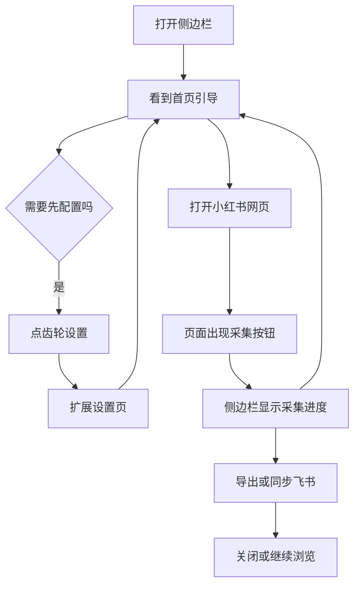
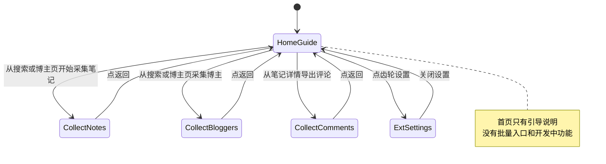

# PRD：侧边栏首页面板收缩

## 文首属性

| 项 | 内容 |
|---|---|
| 状态 | 工程：partial（见文末「工程验收状态」章） |
| 范围 | 侧边栏首页、顶部设置按钮、相关路由清理 |
| 关联文档 | AGENTS.md、docs/doc_index.md |
| 序号 | 00001 |
| 功能 slug | sidepanel-home-slim |

---

## 背景与问题

智赢媒体助手（Chrome 扩展）即将首版上线，当前**仅支持小红书**的笔记、博主、评论采集与飞书同步。

打开侧边栏后，首页仍展示三块菜单：

1. **批量采集**（采集博主 / 笔记 / 评论）
2. **其他功能**（链接转换）
3. **数据中心**（账号管理、采集历史、任务闹钟——均为「功能开发中」占位）

这与真实产品能力不符，带来三类问题：

- **动线错误**：批量采集需要搜索关键词、博主主页或笔记链接等页面上下文，从首页空进采集页无法正确开始任务。
- **半成品印象**：「开发中」占位让用户以为产品未完成，影响上线信心。
- **设置难发现**：顶部只有文字「设置」，样式像普通标签，用户不知道可以点开配置飞书与下载选项。

实际上，正确的采集入口已经在小红书页面内：搜索页、博主主页、笔记详情页会出现对应采集按钮。首页应改为**告诉用户去哪用**，而不是重复堆菜单。

---

## 目标与非目标

### 目标（MVP / Release 0）

1. 侧边栏首页改为**极简引导页**：一句话说明用法 + 可选补充说明，无功能菜单。
2. **移除**首页上的批量采集、数据中心、链接转换入口。
3. 顶部设置改为**齿轮图标 +「设置」**，明显可点击。
4. 从小红书页面点采集按钮后，侧边栏内的采集进度页、导出、飞书同步**行为不变**。
5. 所有用户可见文案使用**运营/采集团队能懂的大白话**，不出现技术术语。

### 非目标

- 不新增 RPA、自动化点击、VIP 门控、数据上报。
- 首版不上线「链接转换」功能（代码可保留，入口与路由断开）。
- 首版不做「数据中心」真实能力（账号管理、采集历史、任务闹钟）。
- 不改动小红书页面内采集按钮的交互逻辑（仅调整侧边栏首页）。
- 不新增其他平台（抖音、B 站等）入口。

---

## 术语

| 用户侧说法 | 含义 |
|------------|------|
| 侧边栏 | 点击扩展图标后打开的右侧面板 |
| 扩展设置 | 配置飞书密钥、下载命名、批处理等选项的页面 |
| 采集进度页 | 从小红书页面发起批量采集后，侧边栏里显示进度与结果的区域 |
| 小红书页面内按钮 | 出现在搜索页、博主主页、笔记详情页上的「采集本页笔记」等按钮 |

> 工程侧术语（路由名、组件名等）见本文「功能域（工程映射）」与附录，**不得**出现在用户界面文案中。

---

## 已拍板规则

| 决策项 | 结论 | 状态 |
|--------|------|------|
| 首页内容 | 极简引导 + 设置入口 | 已定 |
| 批量采集入口 | 仅从小红书页面内按钮进入，首页不提供 | 已定 |
| 链接转换 | 首版不上线 | 已定 |
| 数据中心占位 | 首版移除 | 已定 |
| 设置按钮 | 齿轮图标 +「设置」文字 | 已定 |
| 文案语气 | 偏运营/采集团队，口语化、步骤清晰 | 已定 |

---

## 用户与角色

| 角色 | 目标 |
|------|------|
| 内容运营 / 媒介采集团队（主要用户） | 在小红书批量采笔记、博主、评论，导出或同步飞书 |
| 首次使用者 | 快速理解「要去小红书页面上操作」，并完成飞书配置 |
| 产品 / 开发（内部） | 首版界面干净、可上线，减少无效反馈 |

---

## 用户可见文案（定稿）

### 文案原则

| 原则 | 说明 | 禁止出现在界面上的例子 |
|------|------|------------------------|
| 说场景不说技术 | 写「在哪一页点哪个按钮」 | CSUI、Side Panel、batch、路由 |
| 说结果不说实现 | 写「导出表格 / 同步到飞书」 | navigateSidepanel、API |
| 短句、一步一事 | 主说明约 20 字内，补充说明约 40 字内 | 长功能列表、「开发中」占位 |
| 不用内部名称 | 写「侧边栏」「扩展设置」 | PlaceholderPage、feature flag |

### 侧边栏标题

**智赢媒体助手 - 小红书**（保持现状）

### 首页引导区

| 元素 | 文案 |
|------|------|
| 区块标题 | 开始使用 |
| 主说明 | 请打开小红书网页，在对应页面使用采集功能 |
| 补充说明 | 搜索页、博主主页、笔记详情页会出现采集按钮 |
| 小提示 | 首次使用请先点右上角设置，配置飞书与下载选项 |

### 首页场景指引（可选展示，三行列表）

| 场景 | 页面上会出现的按钮（示例） |
|------|---------------------------|
| 搜索页 | 采集本页笔记、关键词博主采集 |
| 博主主页 | 采集博主信息、采集博主笔记 |
| 笔记详情 | 下载图片/视频、复制笔记、同步飞书、导出评论 |

> 以上为说明性文案，帮助用户建立预期；首页不必做成可点击菜单。

### 设置按钮

| 元素 | 文案 / 样式 |
|------|-------------|
| 可见文字 | 设置 |
| 图标 | 齿轮（SettingOutlined） |
| 布局 | 图标在左，「设置」在右 |
| 读屏文案 | 打开扩展设置 |
| 交互反馈 | 鼠标悬停时浅灰背景 + 圆角，表明可点击 |

### 采集进度页

| 元素 | 文案 |
|------|------|
| 返回 | ← 返回（回到首页引导，不是回到旧菜单列表） |

### 首版不再出现的文案

- 「批量采集」「其他功能」「数据中心」
- 「账号管理」「采集历史」「任务闹钟」
- 「链接转换」
- 「功能开发中，敬请期待」
- 首页关于「笔记批量暂不可用」的技术说明（若仍需提示，改到搜索页按钮旁，用用户话：**当前页面暂不支持批量采笔记，请换到搜索页或博主主页**）

---

## 功能域（工程映射）

> 本节供开发实现参考，文案以上一章「用户可见文案」为准。

### 涉及文件

| 文件 | 改动 |
|------|------|
| `src/sidepanel/pages/xiaohongshu/index.tsx` | 重写为极简引导页，移除 Card / MenuItem 菜单 |
| `src/sidepanel/router.tsx` | 移除 placeholder、url-transform 路由分支；`SidepanelHeader` 增加齿轮图标 |
| `src/sidepanel/styles/sidepanel.css` | 可选：设置按钮 hover 样式 |
| `src/sidepanel/pages/general/placeholder.tsx` | Release 0 不再从 router 引用（文件可保留） |
| `src/sidepanel/pages/xiaohongshu/url-transform.tsx` | Release 0 断开路由（文件可保留） |

### 保持不变

| 范围 | 说明 |
|------|------|
| `src/sidepanel/pages/xiaohongshu/batch-*.tsx` | 三个采集进度页逻辑不变 |
| `src/features/xiaohongshu/ui/*-toolbar.tsx` | 小红书页面内采集按钮不变 |
| `src/contents/xiaohongshu-*.tsx` | 页面注入逻辑不变 |
| `navigateSidepanel` 消息链 | 从页面跳转到采集进度页的方式不变 |
| `/xiaohongshu/batch-collect/*` 路由 | 保留，供页面内按钮跳转 |

### 设置按钮实现要点

当前 `SidepanelHeader` 为纯文字 Button。目标：

- 引入 `@ant-design/icons` 的 `SettingOutlined`
- `icon={<SettingOutlined />}` + children「设置」
- `aria-label="打开扩展设置"`
- 可选 `className="sidepanel-header__settings"` 配合 CSS hover

### 旧路由处理

用户若通过历史书签访问已移除路径（如 `/general/data-center/account`、`/xiaohongshu/other/url-transform`），应**回到首页引导**，不出现「功能开发中」占位页。

### 可选清理（非 Release 0 必须）

- `src/sidepanel/components/platform-switcher.tsx` 当前未被引用，可后续删除

---

## 用户故事地图与版本切片

### 用户旅程主干

| 阶段 | 用户想做什么 | 怎么开始 | 怎样算完成 |
|------|--------------|----------|------------|
| 打开侧边栏 | 搞清楚这工具怎么用 | 点浏览器扩展图标 | 10 秒内明白「要去小红书页面上操作」 |
| 配置 | 接好飞书、设好下载 | 点右上角齿轮「设置」 | 扩展设置保存成功 |
| 采集 | 批量拿笔记 / 博主 / 评论 | 在小红书页面点采集按钮 | 表格导出或飞书同步成功 |
| 离开 | 继续工作或关闭 | 关侧边栏或回小红书浏览 | 无报错、无困惑 |

**Entry**：用户点击扩展，打开侧边栏。  
**Exit (Teardown)**：用户关闭侧边栏或完成导出/同步后继续浏览小红书。

### 用户故事地图

#### 阶段一：打开侧边栏

| 故事 | 验收要点 |
|------|----------|
| 作为新用户，我想一打开就知道下一步去哪 | 首页显示「开始使用」及主说明、补充说明；无功能菜单卡片 |
| 作为新用户，我不想看到还没做好的功能 | 首页不出现「账号管理」「采集历史」「任务闹钟」「链接转换」及「功能开发中」 |
| 作为新用户，我想知道各页面有什么按钮 | 首页有场景指引（搜索页 / 博主主页 / 笔记详情）或等价补充说明 |

#### 阶段二：配置

| 故事 | 验收要点 |
|------|----------|
| 作为用户，我想一眼找到设置 | 右上角同时有齿轮图标和「设置」二字；悬停有可点击反馈 |
| 作为用户，我想点设置就能配飞书 | 点击后打开扩展设置页；读屏朗读「打开扩展设置」 |

#### 阶段三：在小红书页面采集

| 故事 | 验收要点 |
|------|----------|
| 作为用户，我知道批量采集要从页面开始 | 首页没有「采集笔记/博主/评论」菜单项 |
| 作为用户，我在搜索页能采笔记和博主 | 「采集本页笔记」「关键词博主采集」仍可用，点击后侧边栏进入采集进度页 |
| 作为用户，我在博主页能采博主和笔记 | 「采集博主信息」「采集博主笔记」仍可用 |
| 作为用户，我在笔记详情能导出评论 | 「导出评论」仍可用，侧边栏进入评论采集进度页 |

#### 阶段四：采集完成与返回

| 故事 | 验收要点 |
|------|----------|
| 作为用户，采完后我想回到简单首页 | 采集进度页点「← 返回」回到极简引导页，不是旧菜单列表 |
| 作为用户，我想导出或同步飞书 | 采集进度页导出 CSV、飞书同步能力与改版前一致 |

### Release 切片

| Release | 范围 | 可验收结果 |
|---------|------|------------|
| **R0 MVP（上线）** | 极简首页；移除首页批量/数据中心/链接转换；齿轮设置；旧路由回首页 | 新用户 30 秒内理解用法；首页无「开发中」；设置入口可识别 |
| **R1（可选）** | 首页增加「飞书是否已配置」轻提示 | 未配置时引导用户点设置，文案仍为用户语言 |
| **R2（远期）** | 链接转换、数据中心真实能力 | 独立 PRD，再开入口 |

---

## 核心流程与状态机

### 主业务流程



### 侧边栏页面状态



---

## 扩展架构衔接

本需求仅改侧边栏 UI 与路由，不改动三层脚本分工：

```
小红书页面（MAIN world 拦截 API）
    ↓ 页面内采集按钮
ISOLATED world / CSUI
    ↓ navigateSidepanel
侧边栏（采集进度页）+ Service Worker（飞书跨域、下载）
```

- 飞书请求仍经 background，content 不直接 fetch 飞书。
- 批量采集仍依赖页面上下文（关键词、URL 等），由页面按钮携带参数跳转采集进度页。

---

## 边界与异常

| 情形 | 期望行为 |
|------|----------|
| 用户未打开小红书就打开侧边栏 | 仅显示首页引导，不报错 |
| 从页面进入采集进度页后点返回 | 回到极简首页引导 |
| 访问已移除的旧路径 | 回到首页引导，不显示「功能开发中」 |
| 笔记批量采集在部分页面不可用 | 首页不展示禁用说明；若需提示，放在对应页面按钮旁 |
| 飞书未配置 | 页面内「同步飞书」仍可按现有逻辑提示；扩展设置页引导配置 |
| 用户在小红书以外网站打开侧边栏 | 首页引导仍可用；无页面内采集按钮属正常 |

---

## 成功标准

| 指标 | 目标 |
|------|------|
| 理解时间 | 新用户打开侧边栏后 30 秒内能说出「要去小红书页面上点采集按钮」 |
| 首页干净度 | 首页零「开发中」、零未上线功能入口 |
| 设置可发现性 | 齿轮 + 文字设置；定性：比改版前更容易被注意到 |
| 采集动线 | 从小红书页面进入采集进度页的成功率与改版前一致 |

---

## 依赖

- 现有小红书 CSUI 工具栏（搜索页、博主页、笔记详情）正常工作。
- 扩展设置页（`options.tsx`）已支持飞书 App ID/Secret、下载配置等。
- Ant Design 6 与 `@ant-design/icons` 已在项目中可用。

---

## 假设与待确认

| 项 | 假设 | 状态 |
|----|------|------|
| 链接转换代码 | Release 0 仅断路由与入口，不删源文件 | 建议采纳 |
| 首页场景指引 | 采用三行文字列表，不做复杂插图 | 已定 |
| R1 飞书配置提示 | 首版不做，上线后视反馈再加 | 待定 |

---

## 附录：工程术语对照（不进 UI）

| 工程术语 | 用户侧说法 |
|----------|------------|
| Sidepanel / Side Panel | 侧边栏 |
| Options page | 扩展设置 |
| CSUI | 小红书页面内的采集按钮区域 |
| batch-collect 子页 | 采集进度页 |
| navigateSidepanel | （不对用户展示） |
| PLACEHOLDER_TITLES 路由 | 已移除的数据中心占位 |

---

## 修订记录

| 日期 | 说明 |
|------|------|
| 2026-06-06 | 初稿：极简首页、移除占位与链接转换入口、齿轮设置、用户可见文案定稿 |

## 1. 工程验收状态

> 由 `/team:prd-accept` 维护；勿手工编造「通过」。最后更新：2026-06-06T13:24:00Z，dev@a3b53d7，范围：all。

### 总览

**工程状态**：`partial`（R0/R1 核心能力已落地，存在与 PRD 定稿文案/顶栏样式的已知偏差）

**验收判定**：侧边栏首页已改为引导页卡片布局，旧占位/链接转换路由已断开并回落首页；batch 采集链路与 `navigateSidepanel` 保留；R1 飞书配置轻提示已实现并有单测。顶栏在后续视觉改版中改为 Logo+产品名、设置仅齿轮无「设置」二字，与 PRD §用户可见文案 定稿不完全一致。

**最近验收**：2026-06-06，`dev@a3b53d7`

**摘要**：
- R0 极简引导、移除首页批量/数据中心/链接转换入口 — 已实现
- 旧路由 `/general/data-center/*`、`/xiaohongshu/other/url-transform` 回落首页 — 已实现
- R1 飞书未配置 warning / 已配置确认 — 已实现
- 设置按钮：齿轮 + `aria-label` + hover 已有，可见「设置」二字缺失（部分）
- 侧边栏标题 PRD 定稿「智赢媒体助手 - 小红书」→ 现为 `getExtensionName()` 无后缀（部分）

### Release 交付

| Release | 状态 | 说明 |
|---------|------|------|
| R0 MVP | 部分 | 引导页与路由清理完成；设置按钮、顶栏标题与 PRD 定稿有偏差 |
| R1 飞书配置提示 | 通过 | `useFeishuConfigured` + 首页 Alert/已配置文案 |
| R2 链接转换/数据中心 | 范围外 | 未纳入本次验收 |

### 功能验收清单（Agent 优先读此表）

| ID | 能力摘要 | Release | 状态 | 证据 |
|----|----------|---------|------|------|
| R0-01 | 首页极简引导（开始使用、主/补充说明、场景三行） | R0 | 通过 | `src/sidepanel/pages/xiaohongshu/index.tsx` |
| R0-02 | 移除首页批量采集/数据中心/链接转换入口 | R0 | 通过 | 同上；首页无相关 MenuItem/Card 菜单 |
| R0-03 | 顶栏齿轮设置，hover 可点击反馈 | R0 | 部分 | `src/sidepanel/router.tsx` `SidepanelHeader`；`sidepanel.css` `.sidepanel-header__settings`；缺可见「设置」文字 |
| R0-04 | 读屏「打开扩展设置」、点击打开 options | R0 | 通过 | `router.tsx` `aria-label` + `openOptionsPage` |
| R0-05 | 旧路由回落首页，无「功能开发中」占位 | R0 | 通过 | `router.tsx` `REMOVED_ROUTES`；未引用 `PlaceholderPage` |
| R0-06 | batch 采集进度页与返回首页 | R0 | 通过 | `router.tsx` batch 路由 + `← 返回` → `/xiaohongshu` |
| R0-07 | 页面内采集按钮 → 侧边栏进度页链路不变 | R0 | 通过 | `csui-button.tsx`、`search-page-toolbar.tsx`、`note-detail-toolbar.tsx` 仍调 `navigateSidepanel` |
| R0-08 | 侧边栏标题「智赢媒体助手 - 小红书」 | R0 | 部分 | 现为 Logo + `getExtensionName()`，无「- 小红书」后缀 |
| R0-09 | 首页无技术术语/「开发中」文案 | R0 | 通过 | 首页文案 grep 无「功能开发中」；batch 页标题含「批量采集」属进度页非首页 |
| R1-01 | 飞书未配置 warning，可点打开设置 | R1 | 通过 | `index.tsx` Alert + `use-feishu-configured.ts` |
| R1-02 | 飞书已配置轻确认文案 | R1 | 通过 | `index.tsx` `CheckCircleOutlined` 行 |
| R1-03 | `isFeishuConfigured` 单测 | R1 | 通过 | `src/features/feishu/is-feishu-configured.test.ts` |
| R2-01 | 链接转换/数据中心真实能力 | R2 | 范围外 | 源文件保留，路由未注册 |

### 未完成与遗留

1. **设置按钮可见文案**：PRD 定稿要求齿轮 +「设置」二字；当前仅齿轮图标（视觉改版引入，需产品确认是否回改或更新 PRD 定稿）。
2. **侧边栏标题**：PRD 定稿「智赢媒体助手 - 小红书」；当前为扩展名无平台后缀。
3. **文档**：`docs/doc_index.md` / `docs/faqs/` 未新增侧边栏首页改版说明（非阻塞，建议补 FAQ）。
4. **视觉扩展**：「当前支持的平台」卡片为视觉改版新增，不在原 PRD R0 范围，功能为打开小红书官网，已验收通过。

### 质量检查

| 检查项 | 状态 |
|--------|------|
| pnpm test | 通过（83 tests，含 `is-feishu-configured`） |
| pnpm build（类型/构建检查） | 通过 |
| 文档与 FAQ 同步 | 部分（无专项文档） |
| AGENTS 架构约束（仅 sidepanel UI/路由） | 通过（未改 background 跨域/CSUI 逻辑） |

---
统计：通过 10 / 部分 3 / 未实现 0 / 范围外 1
