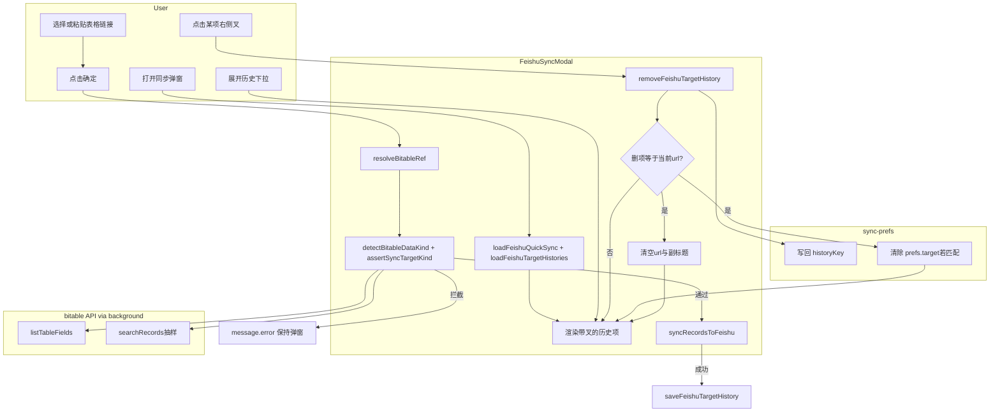
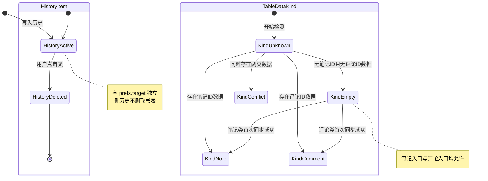

# PRD：飞书同步历史管理与表类型校验

## 文首属性

| 项 | 内容 |
|---|---|
| 状态 | backlog |
| 范围 | 飞书同步弹窗历史下拉、sync-prefs 持久化、同步前笔记/评论表类型 guard |
| 关联文档 | AGENTS.md、docs/doc_index.md、docs/faqs/how-to-feishu-sync-table-target-display.md、prds/prd-00002-feishu-sync-table-target-display.md |
| 序号 | 00003 |
| 功能 slug | feishu-sync-history-type-guard |
| 父 PRD | prds/prd-00002-feishu-sync-table-target-display.md（副标题与分入口缓存，本 PRD 在其上扩展） |

---

## 背景与问题

智赢媒体助手在飞书同步弹窗中提供**历史链接下拉**（`AutoComplete`），便于运营快速选择曾用过的多维表格目标。历史记录保存在本地 `@plasmohq/storage`，每个入口最多 **8 条**（`feishuQuickSyncHistory:${storageKey}`）。

PRD-00002 已解决「看不清链接对应哪张表」的问题（副标题展示 `文档名 · 数据表名`、四入口独立缓存）。但仍有两类新痛点：

### 1. 无效历史链接占满下拉

用户故事：

> 我在飞书里已经删掉了一些多维表格，但扩展的历史下拉里还留着这些链接。下拉又长又乱，有效目标很难找。我希望每条历史旁边有个小叉，让我自己删掉没用的链接，还我一个干净的下拉框。

当前 [`saveFeishuTargetHistory`](src/features/feishu/sync-prefs.ts) 只增不删（除 LRU 顶掉最旧项外），**没有用户主动删除**能力。飞书侧表删除或链接失效后，本地条目仍占位。

### 2. 笔记表与评论表互相写错

用户故事：

> 我有时会把用户评论和用户笔记的多维表格搞混——原来存评论的表，后来误选了同步笔记；或者反过来。希望程序在同步前做一次最基本校验：表里已经存了评论就不能再存笔记，已经存了笔记就不能再存评论，并提示我换表。

笔记类（笔记详情、批量笔记）与评论类（批量评论）使用不同列定义（[`NOTE_COLUMNS`](src/features/xiaohongshu/columns/note.ts) vs [`COMMENT_COLUMNS`](src/features/xiaohongshu/columns/comment.ts)），合并唯一键分别为「笔记ID」与「评论ID」。现有 [`ensureSyncFields`](src/features/feishu/ensure-fields.ts) 仅校验**字段类型兼容**，不区分业务数据类型，无法阻止跨类型误写。

---

## 目标与非目标

### 目标

1. **历史链接可逐条删除**：下拉每项右侧提供 ×，点击后从该入口历史中移除并持久化。
2. **删除与当前选中联动**：若删除项为当前输入框 URL 或 prefs 中 saved target，清空选中态与副标题。
3. **笔记/评论表类型互斥校验**：同步提交前检测目标表是否已承载另一类数据；冲突则拦截并中文提示。
4. **空表放行**：目标表尚无笔记/评论业务数据时，允许首次同步以「定类型」。
5. **快捷同步同逻辑**：笔记详情「本次会话不再弹框」路径同样执行 guard。
6. 所有用户可见文案为中文；飞书请求仍仅经 background。

### 非目标

- 博主表与笔记/评论互斥（用户已明确排除；[`BLOGGER_COLUMNS`](src/features/xiaohongshu/columns/blogger.ts) 不纳入 guard）。
- 「一键清空全部历史」或选项页批量管理历史。
- 自动修复、迁移或合并错表数据。
- 跨入口共享「表类型」元数据（类型判定仅运行时读飞书表结构 + 抽样记录）。
- 飞书侧表已删时的**自动**清理历史（用户手动 × 删除即可；不做后台探测批量清理）。
- RPA、VIP 门控、数据上报、自定义 CSP、manifest 新权限。

---

## 术语

| 用户侧说法 | 含义 |
|------------|------|
| 历史链接 | 该入口曾成功使用过的表格 URL 及 metadata，存于本地 history 列表 |
| 小叉 / 删除 | 从历史列表移除单条链接，不影响飞书云端表格 |
| 笔记类同步 | 笔记详情、批量笔记入口，写入 NOTE_COLUMNS 结构 |
| 评论类同步 | 批量评论入口，写入 COMMENT_COLUMNS 结构 |
| 空表 | 目标数据表中「笔记ID」「评论ID」字段均无业务数据（见判定规则） |
| 定类型 | 空表首次成功同步后，该表在 guard 语义下归属笔记类或评论类 |

| 工程侧术语 | 含义 |
|------------|------|
| storageKey | 各入口 prefs/history 命名空间，见 [`FEISHU_TARGET_KEYS`](src/features/feishu/sync-prefs.ts) |
| FeishuBitableTarget | `{ url, appName?, tableName?, resolvedAt? }` |
| removeFeishuTargetHistory | 新增 API：按 url 从历史数组移除并写回 storage |
| TableDataKind | `empty` \| `note` \| `comment` \| `conflict` |
| assertSyncTargetKind | 同步前 guard：入口期望类型 vs 表内判定类型 |

---

## 已拍板规则

| 决策项 | 结论 | 状态 |
|--------|------|------|
| 表类型互斥范围 | 仅笔记类 vs 评论类 | 已定 |
| 空表行为 | 允许首次写入，以首次成功同步定类型 | 已定 |
| 历史删除方式 | 下拉每项 × 逐条删，无「清空全部」 | 已定 |
| 删当前选中项 | 清空 url、副标题、ambiguous 状态；不自动选下一条 | 已定 |
| 删项与 prefs.target 相同 | 一并清除 saved target（保留 mode/fieldOptions 等） | 已定 |
| 删除是否依赖 API | 否；表已删仍可删本地历史 | 已定 |
| guard 触发时机 | 点「确定」/ 快捷同步执行前，resolve 成功后 | 已定 |
| guard API 失败 | **blocking**：不执行 sync，提示检查网络/权限 | 已定 |
| 两侧都有数据 | hard block + 专用冲突文案 | 已定 |
| 博主入口 | 不执行 note/comment guard | 已定 |

---

## 用户与角色

| 角色 | 目标 |
|------|------|
| 内容运营 / 媒介采集（主） | 干净的历史下拉；避免笔记/评论写错表 |
| 首次配置飞书用户 | 误选时立刻得到可理解的拦截提示 |
| 开发（内部） | 扩展 sync-prefs / sync-modal，新增 table-type-guard，不破坏 PRD-00002 已有能力 |

---

## 功能域

### 功能 A：历史链接删除

#### 交互规格

| 元素 | 行为 |
|------|------|
| 历史下拉项 | 左侧：`文档名 · 表名`（无 metadata 时 fallback URL 截断）；右侧：× 图标 |
| 点击 × | `stopPropagation`；不选中该项；调用删除逻辑 |
| 点击项正文 | 现有行为：选中 URL，解析副标题 |
| 删除成功 | `message.success('已删除历史链接')`（可选，实现时可改为静默） |
| 删最后一条 | 下拉关闭；仅支持手动输入 URL |

#### `removeFeishuTargetHistory` 行为（工程契约）

```typescript
// sync-prefs.ts — 新增
async function removeFeishuTargetHistory(
  storageKey: string,
  url: string
): Promise<FeishuBitableTarget[]>
```

| 步骤 | 行为 |
|------|------|
| 1 | 从 `loadFeishuTargetHistories(storageKey)` 结果中 filter 掉 `item.url === url` |
| 2 | `storage.set(historyKey(storageKey), filtered)` |
| 3 | 若 `loadFeishuQuickSync(storageKey).target.url === url`：调用 `saveFeishuQuickSync` 清除 `target`（`target` 置 `undefined`，**不**删 mode / fieldOptions / shouldUploadMedia） |
| 4 | 返回更新后的 histories 数组供 UI setState |

#### sync-modal 联动

| 条件 | UI 响应 |
|------|---------|
| 删除 url ≠ 当前 form.url | 仅更新 `histories` / `urlOptions` |
| 删除 url === 当前 form.url | `form.setFieldValue('url', '')`；`displayStatus → empty`；`displayLabel → ''`；清空 ambiguous 状态 |
| 删除后 histories.length === 0 | `urlDropdownOpen → false` |

#### UI 实现指引

- 文件：[`src/features/feishu/sync-modal.tsx`](src/features/feishu/sync-modal.tsx)
- 使用 `AutoComplete` 的 `optionRender`（Ant Design 5+）自定义每项布局
- 图标：`CloseOutlined`，hover 时颜色 `#ff4d4f`，`aria-label="删除历史链接"`

---

### 功能 B：笔记/评论表类型校验

#### 入口与期望类型映射

| storageKey | 入口 | 期望 sync kind |
|------------|------|----------------|
| `qmc-feishu-target:note-detail` | 笔记详情 | `note` |
| `qmc-feishu-target:batch-note` | 批量笔记 | `note` |
| `qmc-feishu-target:batch-comment` | 批量评论 | `comment` |
| `qmc-feishu-target:batch-blogger` | 批量博主 | **不校验**（跳过 guard） |

判定依据 **飞书表内现有数据**，不依赖本地 prefs。

#### 类型判定规则

```
1. listTableFields(ref) 获取字段列表
2. 若存在字段「评论ID」→ searchRecords 抽样是否存在评论ID 非空记录
   → 有 → kind = comment
3. 否则若存在字段「笔记ID」→ 抽样是否存在笔记ID 非空记录
   → 有 → kind = note
4. 否则 → kind = empty
5. 若步骤 2、3 均检出数据 → kind = conflict
```

**抽样策略**（避免全表扫描）：

- 使用 [`searchRecords`](src/features/feishu/bitable.ts)，`page_size: 1`
- body 带 `field_names: ['评论ID']` 或 `['笔记ID']`，配合 filter 条件「字段非空」（实现时按飞书 API 文档构造 filter；若 filter 不可用，fallback：拉取最多 20 条记录在客户端判断）
- 任一字段有值即判定为该类型

**空表定义**：`comment` 与 `note` 判定均为否 → `empty` → **允许**任意笔记类或评论类入口同步。

#### Guard 决策矩阵

| 表 kind \ 入口 kind | note 入口 | comment 入口 |
|---------------------|-----------|--------------|
| empty | 允许 | 允许 |
| note | 允许 | **拦截** |
| comment | **拦截** | 允许 |
| conflict | **拦截** | **拦截** |

#### 用户可见错误文案（定稿）

| 场景 | 文案 |
|------|------|
| 笔记入口 → 评论表 | 该数据表已用于同步评论，请选择其他表格或新建表格后再同步笔记。 |
| 评论入口 → 笔记表 | 该数据表已用于同步笔记，请选择其他表格或新建表格后再同步评论。 |
| conflict | 该数据表内同时存在笔记与评论数据，请整理表格后重试，或选择其他表格。 |
| guard API 失败 | 无法校验目标表格类型，请检查网络与飞书应用权限后重试。 |

拦截时：`message.error`；**不关闭弹窗**；不调用 `syncRecordsToFeishu`。

#### 模块划分

新建 [`src/features/feishu/table-type-guard.ts`](src/features/feishu/table-type-guard.ts)：

```typescript
export type TableDataKind = 'empty' | 'note' | 'comment' | 'conflict'
export type SyncKind = 'note' | 'comment'

export async function detectBitableDataKind(ref: BitableRef): Promise<TableDataKind>
export function assertSyncTargetKind(
  tableKind: TableDataKind,
  expected: SyncKind
): void // throws Error with 上述中文文案
export function syncKindFromStorageKey(storageKey: string): SyncKind | null
```

调用点：

1. [`sync-modal.tsx`](src/features/feishu/sync-modal.tsx) — `submit` 内，`resolveBitableRef` 成功后、`syncRecordsToFeishu` 之前
2. [`note-detail-toolbar.tsx`](src/features/xiaohongshu/ui/note-detail-toolbar.tsx) — 快捷同步路径

---

## 用户故事地图与版本切片

### 用户旅程主干

| 阶段 | 用户想做什么 | Entry | Exit (Teardown) |
|------|--------------|-------|-----------------|
| 打开弹窗 | 选目标表 | 点「同步飞书」 | 弹窗打开，历史与副标题就绪 |
| 清理历史 | 去掉无效链接 | 展开历史下拉 | 无效项已删；若删当前项则输入框已清空 |
| 确认目标 | 确保不会写错表 | 选历史或粘贴链接 | 副标题显示文档名·表名 |
| 类型校验 | 提交前最后一道关 | 点「确定」 | 通过→同步；失败→错误提示，弹窗仍开 |
| 完成 | 数据落库 | 同步成功 | toast；prefs/history 更新；关弹窗 |

### 用户故事地图

#### 阶段一：管理历史链接

| 故事 | 验收要点 |
|------|----------|
| 作为运营，我想删掉飞书已删表对应的历史链接 | 点 × 后该项不再出现在下拉；刷新弹窗仍不出现 |
| 作为运营，我想在下拉里快速辨认要删哪条 | 项展示「文档名 · 表名」；重名时带 URL 截断后缀（与 PRD-00002 一致） |
| 作为运营，我删的是当前选中的链接 | 输入框清空；副标题消失；需重新输入或选择 |
| 作为运营，我删的不是当前选中 | 当前 url 与副标题不变 |
| 作为运营，表在飞书已不存在 | 仍可删除本地历史；不依赖解析 API 成功 |

#### 阶段二：笔记/评论防误写

| 故事 | 验收要点 |
|------|----------|
| 作为运营，批量评论时不想写到笔记表 | 目标表已有笔记ID 数据时，点确定被拦截并提示换表 |
| 作为运营，批量笔记时不想写到评论表 | 目标表已有评论ID 数据时，点确定被拦截 |
| 作为运营，新空表第一次同步笔记 | 允许同步；之后该表对评论入口拦截 |
| 作为运营，新空表第一次同步评论 | 允许同步；之后该表对笔记入口拦截 |
| 作为运营，快捷同步也要防误写 | 笔记详情跳过弹窗时，guard 失败 toast，不写数据 |
| 作为运营，批量博主同步 | 不触发 note/comment guard，行为与现网一致 |

#### 阶段三：异常与权限

| 故事 | 验收要点 |
|------|----------|
| 作为运营，guard 检查时网络失败 | 不同步；提示检查网络与权限 |
| 作为运营，表里笔记评论混在一起 | 两侧都有数据时拦截，提示整理表格 |

### Release 切片

| Release | 范围 | 可验收结果 |
|---------|------|------------|
| **R0** | `removeFeishuTargetHistory` + sync-modal × UI + prefs 联动 + 单元测试 | 用户可逐条删历史；删当前项时输入框与 prefs.target 正确清空 |
| **R1** | `table-type-guard.ts` + sync-modal submit guard + note-detail 快捷同步 guard + 测试 | 笔记/评论误选错表时被拦截；空表首次同步正常 |
| **R2（可选）** | blur 时预校验，副标题旁黄色警告；FAQ 增补一节 | 用户提交前更早看到类型风险提示 |

---

## 核心流程与状态机

### 主业务流程（含删除与 guard）



### 历史项与表类型状态图



---

## 扩展架构衔接

本 PRD 在 PRD-00002 配置层之上增加 **prefs 写删** 与 **同步前 guard**，不改变三层脚本与 sync 核心：

```
FeishuSyncModal / note-detail-toolbar
  → sync-prefs (load/save/remove history & target)
  → resolveBitableRef + resolveBitableTargetDisplay (bitable.ts)
  → table-type-guard.ts (NEW: listTableFields + searchRecords 抽样)
  → syncRecordsToFeishu (不变)
      → ensure-fields → field-mapper → 素材上传
```

- 所有飞书 OpenAPI 经 [`feishuRequest`](src/features/feishu/client.ts) → background fetch。
- Content script **不得**直接 fetch `open.feishu.cn`。
- 改动 guard 或 bitable 辅助函数后，用户需在 `chrome://extensions` **重新加载**扩展。

### 涉及文件清单

| 文件 | 改动 |
|------|------|
| [`src/features/feishu/sync-prefs.ts`](src/features/feishu/sync-prefs.ts) | 新增 `removeFeishuTargetHistory`；删 target 联动 |
| [`src/features/feishu/sync-modal.tsx`](src/features/feishu/sync-modal.tsx) | 历史项 ×、`optionRender`、submit guard |
| [`src/features/feishu/table-type-guard.ts`](src/features/feishu/table-type-guard.ts) | **新建** detect + assert |
| [`src/features/feishu/bitable.ts`](src/features/feishu/bitable.ts) | 可选：`hasRecordsWithFieldValue` helper |
| [`src/features/xiaohongshu/ui/note-detail-toolbar.tsx`](src/features/xiaohongshu/ui/note-detail-toolbar.tsx) | 快捷同步 guard |
| [`src/features/feishu/sync-prefs.test.ts`](src/features/feishu/sync-prefs.test.ts) | 删除 history / 清 target 用例 |
| `src/features/feishu/table-type-guard.test.ts` | **新建** guard 矩阵用例 |

### 与 PRD-00002 边界

| PRD-00002 已交付 / 规划中 | 本 PRD 负责 |
|---------------------------|-------------|
| 四入口独立 storageKey | 沿用；删除/guard 均 scoped |
| 副标题「文档名 · 表名」 | 沿用；删当前项时清空 |
| R1 历史下拉富文本展示 | 沿用现有 `buildUrlOptions`；本 PRD 在其上增加 × |
| 选项页统一管理（R2） | **不做** |

---

## 成功标准

| 指标 | 目标 |
|------|------|
| 历史清理 | 用户可在 2 次点击内删除单条无效历史（展开 → 点 ×） |
| 误写防护 | 笔记/评论 cross-type 同步在 submit 前 100% 拦截（自动化用例覆盖 empty/note/comment/conflict） |
| 空表首次同步 | 不增加额外阻断；与现网一致 |
| 回归 | PRD-00002 副标题、分入口缓存、合并/追加同步行为无回归 |

---

## 依赖

| 依赖 | 说明 |
|------|------|
| PRD-00002 | 副标题、FeishuBitableTarget、分入口 storageKey |
| 飞书 bitable 读权限 | listTableFields、records/search（与现有同步一致） |
| Ant Design AutoComplete | `optionRender` 支持自定义删除按钮 |
| `@plasmohq/storage` | history / prefs 持久化 |

---

## 风险与缓解

| 风险 | 缓解 |
|------|------|
| searchRecords filter 语法与字段名不一致 | 实现前用真实表验证；fallback 客户端抽样 |
| guard 增加 submit 延迟 | 仅 1–2 次 API；可接受 |
| 用户手动改字段名（不叫「笔记ID」） | guard 可能漏检；非目标；文档说明保持字段名 |
| 删历史误触 | × 需明确 hover 态；不二次确认（删除可重新同步产生） |

---

## 假设与待确认

| 项 | 默认假设 |
|----|----------|
| 字段中文名 | 判定依赖列定义中的 `name`：「笔记ID」「评论ID」，与 ensure-fields 创建名一致 |
| 删历史 toast | 实现可选静默；以 UI 即时反馈为准 |
| batch-blogger | 永不调用 note/comment guard |

---

## 开放项

| 项 | 说明 | 状态 |
|----|------|------|
| searchRecords filter 精确语法 | 工程实现时对照飞书 OpenAPI 文档验证 | 待工程 |
| R2 blur 预校验 | 是否纳入首个迭代后的迭代 | 可选 |
| FAQ 更新 | `docs/faqs/how-to-feishu-sync-table-target-display.md` 增补删除与 guard 说明 | R2 可选 |

---

## 修订记录

| 日期 | 说明 |
|------|------|
| 2026-06-08 | 初稿：历史链接 × 删除；笔记/评论表类型 guard；R0/R1/R2 切片；关联 PRD-00002 |
