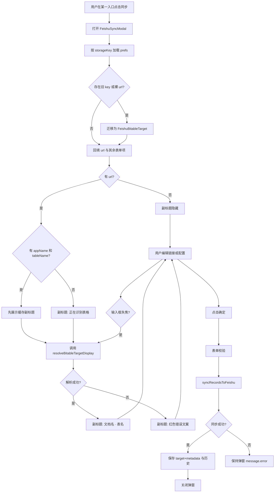
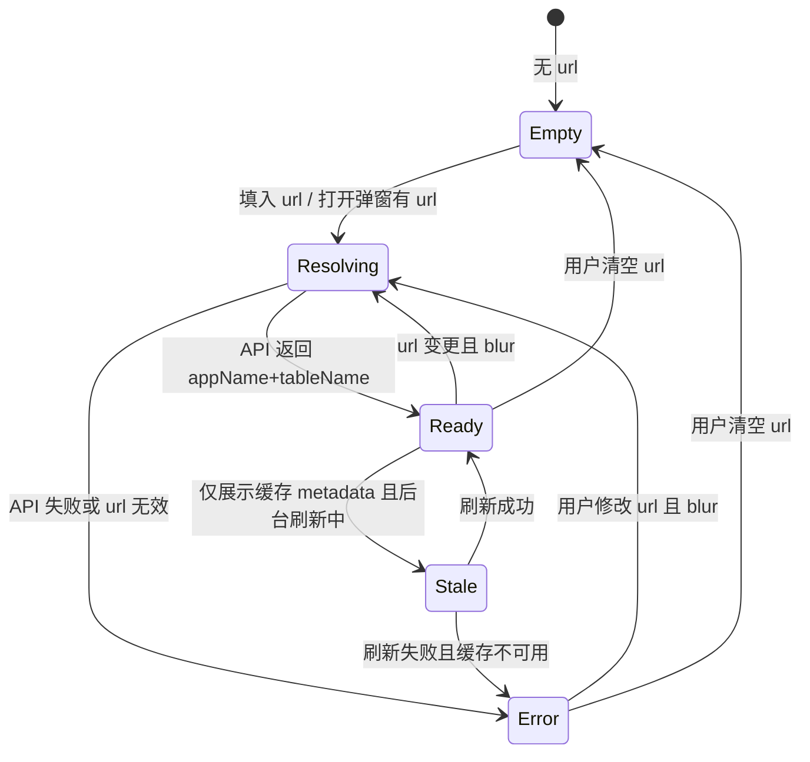

# PRD：飞书同步表格目标可识别与分入口缓存

## 文首属性

| 项 | 内容 |
|---|---|
| 状态 | backlog |
| 范围 | 飞书同步弹窗、各入口 prefs 缓存、bitable 目标解析 |
| 关联文档 | AGENTS.md、docs/doc_index.md、specs/prds/prd-00001-sidepanel-home-slim.md |
| 序号 | 00002 |
| 功能 slug | feishu-sync-table-target-display |

---

## 背景与问题

智赢媒体助手在小红书多个入口支持「一键同步到飞书多维表格」：笔记详情、批量笔记、批量博主、批量评论。同步前会弹出配置弹窗，并**自动回填上次使用的表格链接**。

当前存在两类痛点：

### 1. 链接无法二次确认

弹窗「表格链接」输入框只展示 URL（常被截断），用户**无法从界面判断**这条链接对应哪份多维表格文档、哪张数据表。典型用户故事：

> 我打开了同步飞书弹窗，看到一条缓存链接，但不知道它指向哪个多维表格。为了确认，我不得不再打开飞书、找到目标表、重新复制链接粘贴进来——无法在不离开弹窗的情况下完成二次确认。

这增加了误同步到错误表格的风险，也拖慢日常采集节奏。

### 2. 入口间缓存粒度不足

代码层面已部分区分 storageKey（如笔记详情 `note`、批量评论 `comment`），但**批量笔记与批量博主仍共用** `qmc-quickSyncFeishu-batch`。笔记与评论的**列结构不同**（`NOTE_COLUMNS` vs `COMMENT_COLUMNS`），用户期望各入口记住各自的目标表，避免 A 入口的链接覆盖 B 入口的配置。

---

## 目标与非目标

### 目标（MVP / Release 0）

1. **四个飞书同步入口各自独立缓存**上次目标（笔记详情 / 批量笔记 / 批量博主 / 批量评论）。
2. 同步弹窗在表格链接输入框**下方增加副标题**，展示 `多维表格文档名 · 数据表名`，便于用户一眼确认同步目标。
3. 副标题在**打开弹窗**（有缓存 URL）、**输入框失焦**、**同步成功后**自动解析更新。
4. 解析结果（文档名、表名、规范化 URL）**持久化**到 prefs 与历史记录，减少重复 API 调用。
5. **兼容旧版**仅保存裸 URL 的 prefs，首次打开时 lazy 解析补全 metadata。
6. 所有用户可见文案为中文，偏运营/采集团队口语。

### 非目标

- 不做飞书内「新建表并自动建字段」向导（保留现有「+ 新建」打开飞书 tab）。
- 不做跨设备 / 跨浏览器云同步 prefs。
- 不在选项页做复杂「各入口默认目标」管理（Release 2 以后可选）。
- 不新增 RPA、VIP 门控、数据上报、自定义 CSP。
- Release 0 不改造历史下拉的富文本展示（仍用 URL datalist；Release 1 升级）。

---

## 术语

| 用户侧说法 | 含义 |
|------------|------|
| 多维表格文档 | 飞书 Base 文件或 Wiki 中的多维表格节点，对应 API 的 app |
| 数据表 | 文档内的一张 sheet/table，URL 中 `table=` 参数指定 |
| 表格链接 | 含 `/base/` 或 `/wiki/` 且带 `table` 参数的完整 URL |
| 同步目标 | 一次同步所指向的「文档 + 数据表」组合 |
| 副标题 | 输入框下方一行「文档名 · 表名」的确认信息 |
| 入口 | 触发飞书同步的具体场景（笔记详情 / 批量笔记 / 批量博主 / 批量评论） |

| 工程侧术语 | 含义 |
|------------|------|
| storageKey | 各入口 prefs 在 `@plasmohq/storage` 中的命名空间 |
| FeishuBitableTarget | 含 url、appName、tableName、resolvedAt 的目标对象 |
| resolveBitableRef | 现有链接解析函数，返回 appToken / tableId |

---

## 已拍板规则

| 决策项 | 结论 | 状态 |
|--------|------|------|
| 入口缓存粒度 | 4 个入口各自独立 storageKey | 已定 |
| 字段结构语义 | 笔记向（笔记/博主）与评论向两套列结构；storageKey 不强制合并 | 已定 |
| 目标展示交互 | 保留链接输入框 + 下方副标题 `文档名 · 表名` | 已定 |
| 副标题触发时机 | 弹窗打开（有 URL）、Input blur、同步成功 | 已定 |
| 文档名来源 | 优先 bitable app API 返回名；Wiki 节点名作补充 | 已定 |
| 博主与笔记批量是否共享默认表 | 不共享 storageKey；用户可自行粘贴同一链接 | 已定 |
| 解析失败时 | 副标题红色短文案；不阻塞编辑 URL；同步前仍校验 | 已定 |

---

## 用户与角色

| 角色 | 目标 |
|------|------|
| 内容运营 / 媒介采集团队（主要用户） | 快速确认同步目标，避免写错表；各场景记住各自的目标 |
| 首次配置飞书的用户 | 粘贴链接后立刻看到解析出的文档名和表名，建立信心 |
| 产品 / 开发（内部） | 最小改动扩展 sync-prefs 与 sync-modal，不破坏现有同步链路 |

---

## 用户可见文案（定稿）

### 表格链接区域

| 元素 | 文案 |
|------|------|
| 标签 | 表格链接（必填 *） |
| 输入框 placeholder | `https://xxx.feishu.cn/base/... 或 /wiki/...?table=...` |
| 副标题（解析成功） | `{文档名} · {数据表名}`（灰色，12px） |
| 副标题（解析中） | 正在识别表格… |
| 副标题（空链接） | （不显示） |
| 副标题（解析失败） | 无法识别该链接，请检查格式或飞书配置（红色，12px） |
| 说明条（现有） | 支持飞书多维表格直链（/base/）或知识库 Wiki 链接（/wiki/），需带 table 参数 |
| 「+ 新建」按钮 | + 新建（不变） |

### 其他弹窗文案

保持现有「同步模式」「上传素材」「自定义同步字段」「备注」「本次会话不再弹框」等文案不变。

---

## 功能域（工程映射）

> 本节供开发实现参考，文案以上一章「用户可见文案」为准。

### 现状与差距

| 入口 | 组件 | 当前 storageKey | 目标 storageKey |
|------|------|-------------------|-----------------|
| 笔记详情「同步飞书」 | `src/features/xiaohongshu/ui/note-detail-toolbar.tsx` | `qmc-quickSyncFeishu-note` | `qmc-feishu-target:note-detail` |
| 侧边栏批量笔记 | `src/sidepanel/pages/xiaohongshu/batch-note.tsx` | 默认 `qmc-quickSyncFeishu-batch` | `qmc-feishu-target:batch-note` |
| 侧边栏批量博主 | `src/sidepanel/pages/xiaohongshu/batch-blogger.tsx` | 默认 `qmc-quickSyncFeishu-batch` | `qmc-feishu-target:batch-blogger` |
| 侧边栏批量评论 | `src/sidepanel/pages/xiaohongshu/batch-comment.tsx` | `qmc-quickSyncFeishu-comment` | `qmc-feishu-target:batch-comment` |

共享组件：`FeishuSyncModal`（`src/features/feishu/sync-modal.tsx`）、`FeishuSyncPanel`（`src/sidepanel/components/feishu-sync-panel.tsx`）。

### 数据模型扩展

文件：`src/features/feishu/sync-prefs.ts`

```typescript
export type FeishuBitableTarget = {
  url: string
  appName?: string
  tableName?: string
  resolvedAt?: number
}

export type FeishuQuickSyncPrefs = {
  /** 新字段，替代裸 url */
  target?: FeishuBitableTarget
  /** @deprecated 读取时迁移到 target */
  url?: string
  mode?: "merge" | "append"
  shouldUploadMedia?: boolean
  fieldOptions?: FieldOptions
  remark?: string
}
```

历史记录从 `string[]` 升级为 `FeishuBitableTarget[]`（key 仍为 `feishuQuickSyncHistory:${storageKey}`，需版本迁移或新 key 后缀）。

### 旧数据迁移策略（Release 0）

1. `loadFeishuQuickSync`：若存在 `url` 且无 `target`，构造 `{ url }` 作为 target；写回 storage。
2. `loadFeishuUrlHistories`：若读到 `string[]`，映射为 `{ url }[]` 并写回。
3. 旧 storageKey → 新 storageKey：按映射表读取旧 key 一次，写入新 key 后保留旧 key（不删除，避免回滚丢数据）。

| 旧 key | 新 key |
|--------|--------|
| `qmc-quickSyncFeishu-note` | `qmc-feishu-target:note-detail` |
| `qmc-quickSyncFeishu-batch` | 优先迁移到 `qmc-feishu-target:batch-note`（批量笔记）；批量博主若无独立旧值则空 |
| `qmc-quickSyncFeishu-comment` | `qmc-feishu-target:batch-comment` |

> 批量博主与批量笔记曾共用 `batch`：迁移时仅 `batch-note` 继承旧值；`batch-blogger` 从空开始，用户首次同步后独立记忆。

### Bitable API 扩展

文件：`src/features/feishu/bitable.ts`

- 新增 `getBitableApp(appToken)`：`GET /open-apis/bitable/v1/apps/{app_token}` 取文档名（`app.name` 或等价字段）。
- 扩展 `resolveBitableRef` 或新增 `resolveBitableTargetDisplay(url)`，返回：

```typescript
type ResolvedBitableTarget = BitableRef & {
  normalizedUrl?: string
  appName: string
  tableName: string
}
```

- `listBitableTables` 已返回 `name`；与 app 名组合为副标题。
- 所有飞书请求经 `feishuRequest` → background fetch（见 AGENTS.md）。

### UI 改动

文件：`src/features/feishu/sync-modal.tsx`

1. 新增 state：`displayStatus: 'empty' | 'resolving' | 'ready' | 'error'` 与 `displayLabel: string`。
2. 表格链接 `Form.Item` 内，`Input` 下方渲染副标题区（margin 对齐现有说明条，约 `marginLeft: 25%` 与 labelCol 一致）。
3. `resolveTargetDisplay(url)` 在以下时机调用（防抖 / 取消上一次请求）：
   - 弹窗打开且 prefs 有 url
   - Input `onBlur`
   - `handleSync` 成功后更新 prefs
4. 不在 `onChange` 每键触发 API。
5. `datalist` Release 0 仍用 URL；历史 metadata 存于 prefs 供 Release 1 Select 使用。

### 快捷同步路径

`note-detail-toolbar.tsx` 中「本次会话不再弹框」快捷同步：继续读 prefs 的 `target.url`（或迁移后的 url）；逻辑不变，仅 storageKey 更新。

### 涉及文件清单

| 文件 | 改动 |
|------|------|
| `src/features/feishu/sync-prefs.ts` | 类型扩展、迁移、save/load target+metadata |
| `src/features/feishu/bitable.ts` | getBitableApp、resolveBitableTargetDisplay |
| `src/features/feishu/sync-modal.tsx` | 副标题 UI、解析触发 |
| `src/features/xiaohongshu/ui/note-detail-toolbar.tsx` | 新 storageKey |
| `src/sidepanel/pages/xiaohongshu/batch-note.tsx` | 显式 storageKey |
| `src/sidepanel/pages/xiaohongshu/batch-blogger.tsx` | 显式 storageKey |
| `src/sidepanel/pages/xiaohongshu/batch-comment.tsx` | 新 storageKey |
| `src/sidepanel/components/feishu-sync-panel.tsx` | 默认 storageKey 更新（若有） |

### 保持不变

| 范围 | 说明 |
|------|------|
| `syncRecordsToFeishu` 核心逻辑 | 合并/追加、字段映射、素材上传不变 |
| 飞书 App ID/Secret 配置入口 | 仍在选项页 |
| Modal 宽度、同步模式、字段选择器 | 布局与交互不变 |
| manifest 权限 | 预计不新增（已有 bitable API） |

---

## 用户故事地图与版本切片

### 用户旅程主干

| 阶段 | 用户想做什么 | 怎么开始 | 怎样算完成 |
|------|--------------|----------|------------|
| 采集完成 | 把数据写入飞书 | 点「同步飞书」/「同步到飞书」 | 弹窗打开并回填该入口上次目标 |
| 确认目标 | 确认不会写错表 | 看输入框下方副标题 | 看到「文档名 · 表名」与预期一致 |
| 调整目标 | 换一张表 | 粘贴新链接，失焦 | 副标题更新为新表 |
| 执行同步 | 写入数据 | 点「确定」 | 成功 toast；prefs 与历史更新 |
| 快捷同步 | 同会话不再弹窗 | 勾选「本次会话不再弹框」后再次同步 | 静默同步到已确认目标 |
| 离开 | 继续工作或关闭 | 取消或同步成功后关弹窗 | 无报错、无误同步 |

**Entry**：用户在任一飞书同步入口点击同步按钮。  
**Exit (Teardown)**：同步成功或用户取消；prefs 已按入口持久化。

### 用户故事地图

#### 阶段一：打开同步弹窗

| 故事 | 验收要点 |
|------|----------|
| 作为运营，我想在该入口看到上次用的表 | 笔记详情 / 批量笔记 / 批量博主 / 批量评论各自回填独立缓存的链接 |
| 作为运营，我想一眼知道链到哪个表 | 有缓存 URL 时，输入框下方显示「文档名 · 数据表名」 |
| 作为运营，我不想等太久 | 有本地 metadata 时先展示缓存名，后台可选刷新；无 metadata 时显示「正在识别表格…」 |

#### 阶段二：确认或更换目标

| 故事 | 验收要点 |
|------|----------|
| 作为运营，我想粘贴新链接后确认解析结果 | Input 失焦后副标题更新；失败时红色提示，仍可编辑 |
| 作为运营，我想区分评论表和笔记表 | 批量评论入口不回填批量笔记的链接（独立 storageKey） |
| 作为运营，我想从历史里选以前用过的链接 | Release 0：datalist 仍可选 URL；Release 1：下拉显示文档名·表名 |

#### 阶段三：执行同步

| 故事 | 验收要点 |
|------|----------|
| 作为运营，我想同步到确认的表 | 点确定后走现有 syncRecordsToFeishu；成功 toast 含新增/更新条数 |
| 作为运营，我想下次还记住这张表 | 同步成功后 target（含 appName、tableName、normalizedUrl）写入该入口 prefs 与历史 |
| 作为运营，链接无效时不要被静默写错 | 解析失败或 sync 报错时 message.error；不关闭弹窗 |

#### 阶段四：快捷同步与会话内跳过弹窗

| 故事 | 验收要点 |
|------|----------|
| 作为运营，我勾选「本次会话不再弹框」后想直接同步 | 仍使用该入口 prefs 中的 URL；行为与改版前一致 |
| 作为运营，飞书未配置时我想知道原因 | 副标题或 message 提示前往设置配置 App ID/Secret |

### Release 切片

| Release | 范围 | 可验收结果 |
|---------|------|------------|
| **R0 MVP** | 4 入口独立 storageKey + 旧数据迁移；副标题解析展示；metadata 持久化 | 各入口独立记忆；弹窗可二次确认目标；旧 URL prefs 自动迁移 |
| **R1（应做）** | 历史下拉改为 Ant Design Select，项显示「文档名 · 表名」；快捷同步失败 toast 附带目标名 | 选历史时不靠认 URL |
| **R2（可选）** | 选项页「各入口默认同步目标」统一管理 | 新设备/清缓存后仍有团队默认（需另议权限） |

---

## 核心流程与状态机

### 主业务流程



### 副标题展示状态机（TargetDisplay）



---

## 扩展架构衔接

本功能位于现有飞书同步链路的前置配置层，不改变三层脚本分工：

```
CSUI / Sidepanel (FeishuSyncModal)
  → sync-prefs (@plasmohq/storage, 按入口 storageKey)
  → resolveBitableTargetDisplay (bitable.ts)
      → feishuRequest → background fetch (open.feishu.cn)
  → syncRecordsToFeishu (ensure-fields, field-mapper, 素材上传)
```

- Content script **不得**直接 fetch 飞书 API。
- 新增 `getBitableApp` 与现有 `listBitableTables` 同属 bitable v1 API，经同一 client。
- 改动 background 相关解析后，用户需在 `chrome://extensions` **重新加载**扩展。

---

## 成功标准

| 指标 | 目标 |
|------|------|
| 二次确认 | 用户在不打开飞书的前提下，≥90% 场景可通过副标题确认目标是否正确（主观验收） |
| 误同步 | 因「看不清链接」写错表的反馈趋近于 0（上线后收集） |
| 入口隔离 | 4 入口 prefs 互不影响（自动化或手工用例验证） |
| 兼容 | 升级后旧 `qmc-quickSyncFeishu-*`  prefs 不丢失，至少 note 与 comment 链接可迁移 |

---

## 依赖

| 依赖 | 说明 |
|------|------|
| 飞书 App ID/Secret | 选项页已配置；解析 app/table 名需 tenant access token |
| bitable API 权限 | 应用需有多维表格读权限（与现有同步一致） |
| `@plasmohq/storage` | 本地 prefs 持久化 |
| Ant Design Modal/Form/Input | 现有 UI 栈 |

---

## 风险与缓解

| 风险 | 缓解 |
|------|------|
| 打开弹窗多一次 API，略慢 | 先展示缓存 metadata；解析请求可取消/防抖 |
| Wiki 链接权限不足 | 与现有 resolveBitableRef 相同错误文案 |
| 文档/表重命名后缓存名过期 | 以 blur/同步时实时解析为准；展示名可 stale 但不影响正确 tableId |
| 旧 batch key 迁移歧义 | 仅 batch-note 继承；batch-blogger 文档说明 |

---

## 假设与待确认

| 项 | 默认假设 |
|----|----------|
| 博主批量默认表 | 与笔记批量不共享 storageKey；用户可手动贴同一 URL |
| app 文档名 API 字段 | 以飞书 Open API 文档为准；实现时核对 `app.name` |
| 历史 datalist Release 0 | 仍展示 URL，metadata 仅用于副标题与 R1 Select |

---

## 开放项

| 项 | 说明 | 负责人 |
|----|------|--------|
| batch 旧 key 迁移给 note 还是弹窗提示 | 当前 PRD 定为 batch-note 继承 | 产品已拍板 |
| Release 1 Select 交互稿 | 富文本历史下拉细节 | 实现前 UI 走查 |
| 选项页统一管理（R2） | 是否做、是否需团队共享配置 | 远期 |

---

## 修订记录

| 日期 | 说明 |
|------|------|
| 2026-06-06 | 初稿：分入口缓存 + 副标题二次确认；R0/R1/R2 切片 |
